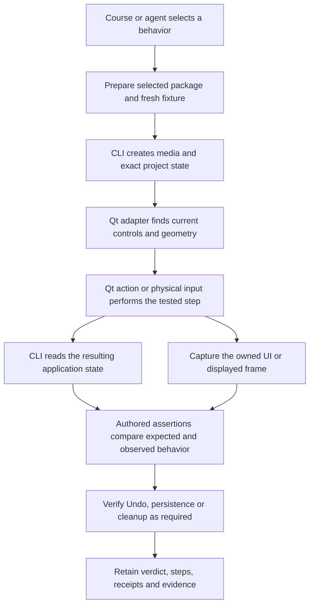

# How Athanor controls and tests Wizard

Athanor combines Wizard's application operations, a Qt test adapter and physical macOS input. A check chooses the layer needed for each step. The course runner keeps the selected build, fixture, assertions and evidence together.

## The three control layers

| Layer | What it sees and does | When to use it |
| --- | --- | --- |
| Wizard CLI | Calls the selected application's operations and reads structured project, timeline, media, graph and transport state. It can run against an owned headless engine or the visible editor's endpoint. | Create fixtures, make application edits, inspect exact identities and timing, save, render and measure output. |
| Qt adapter | Runs inside the selected GUI process. It inspects visible Qt widgets, actions, model rows, graph nodes and ports. It can dispatch Qt actions and events and provide current geometry. | Find an exact control, read its selected state, prepare a panel, exercise a Qt action or locate a canvas target. |
| Physical input and capture | Uses native macOS APIs with the actual Unix PID and verified window. It sends pointer, wheel, text and keyboard events and captures the presented app region. | Test dragging, focus, shortcuts, hit testing and the image a person sees. |

The adapter is a test bridge. It is attached externally to a disposable, byte-identical copy of the selected package. Preparation checks the package and matching tools; it does not substitute a different Wizard build or upgrade Qt globally. The original package remains the build identity in the report, alongside the adapter and input-driver identities.

Qt actions and physical input are distinct. Triggering a QAction exercises the application's action handler. A physical click also exercises window targeting, pointer position and hit testing. Sending a Qt key event tests the Qt handler; a native key tests the actual focused window and keyboard route. A check must describe which one it uses.

## Example: trim a clip

The CLI creates a disposable timeline with a known four-second clip and exact source timing. The adapter locates the displayed timeline and asks the packaged editor for that clip's current rectangle. Physical input drags the visible right edge.

The CLI then reads the timeline. The assertion requires the same clip and asset, an unchanged left edge, a shorter right edge, a matching shortened source range and valid frame alignment. A presented capture records the result. Physical Undo must restore the exact baseline before the check can pass.

An application trim operation can verify timing rules quickly, but it will not catch a broken edge hit target or drag handler. A screenshot can show a shorter rectangle, but cannot reliably establish exact source-frame bounds. Using both gives us a real gesture and a precise outcome check.

## Example: wire two graph nodes

Application operations prepare a source and effect with a disconnected input. The adapter binds the visible graph and node identities to the intended clip, then provides current port positions. Physical input drags the source output onto the effect input.

The graph readback must contain the intended edge and preserve unrelated nodes and connections. Undo must remove that edge; Redo must restore it. A successful input receipt records the gesture, while the graph assertion determines the verdict.

## Who decides Pass?

The authored assertion decides. A command returning successfully, a click being dispatched or an agent describing a good result is not enough.

Scripted checks run maintained assertions against observed state, pixels, decoded media or measurements. Interactive agent attempts have a separate frozen proof contract when toolkit Pass is supported. Those contracts bind the fixture, permitted actions, verification checkpoints and captures. Exploration without that contract still produces useful observations and diagnostic reports.

The controls work from current observations. Ambiguous targets, incomplete model or scene inspection, missing capabilities and unavailable setup produce Blocked. A dispatched mutation whose outcome cannot be established stays Unknown. The session records it and does not replay it. A failed assertion stays Fail, and independent checks continue in fresh owned groups after safe cleanup.

## Evidence and investigation

The runner retains the exact selection, definition and source snapshots, package/tool hashes, fixture identities, application requests, adapter observations, native input receipts, readable steps and declared artifacts outside Git. Widget rasters explain Qt controls; presented captures show the composed app image, including GPU previews. Tests needing motion or audio must declare and collect those observations.

The report connects a result to what the check did and measured. Investigation packages preserve the original failure, separate harness/environment/app findings, group supported duplicates and prepare a focused diagnostic selection. A person reviews the resulting evidence and Report a Bug drafts before submission.

## Reuse the same pieces

An agent can select an existing check, compose accepted checks into a course, or author a candidate using the same fixture, control and assertion modules. Give it the context pack from `context --check ID --export`. For a maintained desktop candidate, the pack supplies a `smoke-full` subset selection and normal plan/run commands. Save its selection JSON to the specified file before planning.

Keep setup, the tested action, independent assertions, evidence and cleanup separate. Use CLI setup before a physical gesture, then observe the result without an operation that repairs or changes it. Pure assertion functions should reject a small wrong-state example without opening Wizard.

## Adapter readback improvements

Version 8 includes the read-only `model` tool. It pages immediate model rows under the visible view root, up to 64 rows and six displayed columns per request. Follow `nextOffset` until null. These pages read live state; restart if the model changes and refresh geometry before input. This extends row inspection beyond the original first-64-row sample without sending the entire editor to an agent.

Timeline widgets expose up to 1024 sorted clip IDs through the selected package's exported public getter. `clipIdsTruncated` identifies a capped set, and an unavailable getter leaves the identities absent. The geometry route still uses `clipRectFor`; this adds an identity observation alongside it.

A Qt component fixture verified 201 rows, a nested view root, offscreen geometry and malformed requests. A live owned nightly fixture verified three native pages containing all five rows, the user-facing agent command, and exact agreement between displayed clip IDs and CLI readback. This used the selected package and matching external adapter.

## Current expansion

Four new candidates cover project search while switching timeline focus, physical blur Inspector editing, mask-node clipboard/history and vectorscope response across available taps. Each is isolated so an unrelated failure cannot supply its baseline. They are included in `smoke-full` revision 4 and can be selected as a focused subset. Their assertions and course wiring have framework tests. On the October 2 nightly, both connection prerequisites passed. After clearing the Screenshot overlay and excluding the system cursor from pointer obstruction checks, project search across A/B/A focus and physical blur editing/Undo passed. Mask Copy/Paste created an independent rectangle but added an unexpected output-to-input edge; that failure is retained. The vectorscope candidate ran: transport and presented pixels confirmed the black gap and colour plate, but Post IDT did not show the required scope response. That failure is retained for investigation; the candidates are not promoted to accepted checks.

The remaining checklist includes provider-backed Oz/Spell execution, a historical project, AU/OFX fixtures, a second display, NAS paths and longer performance measurements. Those need their real inputs and environments. Deterministic local graphics and synthetic media remain useful fixtures for the paths they actually exercise.

Implementation entry points: [application/session adapter](../desktop/adapter.mjs), [physical input](../desktop/physical-input.mjs), [agent tools](../desktop/agent-tools.mjs), [course selection](../runner/catalog.mjs), [new checks](../desktop/check-checklist-expansion.mjs), and [test authoring](test-evidence.md).

## Project workflow expansion

Revision 4 adds isolated candidates for New Project, Save As and projectless Preferences. New Project and Save As use observed Qt controls, serialized CLI readbacks, saved timeline hashes, normal Quit acknowledgments and a fresh process to verify reopening and preservation of the original. Projectless Preferences starts at the observed hub, visits the Application pages, cancels, then reopens and verifies the original. Project rebinding follows the actual window title and owned destination. Unknown mutations now guard scripted and interactive sessions alike: inspection remains available, further writes require resolution, and shutdown preserves the uncertain fixture.

Subprocess exit codes are diagnostic data. Step and result boundaries preserve semantic Fail, Blocked and Unknown verdicts; attachment-library inspection failures retain their process receipt and cannot become numeric test outcomes.

On `2026.10.02-39f5d60`, New Project and projectless Preferences passed in attempt `841797ff-2dbc-4f17-9bfb-fbd3b7ccbc17`. A fresh Save As-only attempt `514cfc6d-f087-456a-82a7-d5c449700083` passed normal Quit, copy reopening and original preservation. The earlier Save As loaded-library inspection failure remains retained; it did not recur. These results qualify this package and procedure locally, with candidate lead acceptance still pending.

## Search, clipboard and history expansion

Revision 5 adds isolated candidates for missing-term filename search, physically copying/pasting 100 clips and 50 physical edits with Undo/Redo on a seeded history. `desktop/volume-proof.mjs` exposes their independent assertions for reuse. Each candidate can be selected alone with its two connection prerequisites. Captures, input receipts, timeline/search observations and history latency samples are declared in the definitions. Timing includes dispatch and state verification; it is a measurement rather than a speed verdict. Runtime qualification and lead acceptance remain separate.

The long physical history driver has an explicit eight-minute execution budget in revision 6. Normal foreground scripts retain their two-minute default. Timing samples cover native input through independent readback; the fifty setup renames are reported as seeded commands, rather than an unobserved count of undo-stack entries. Interrupted script receipts retain Unknown with timeout/cancellation/overflow diagnostics.

On `2026.10.02-39f5d60`, attempt `632f1238-5e9b-4184-9a26-dac38ed8ea5d` passed missing-term Name search and the 100-clip clipboard path, including exact displayed IDs, Undo and Redo. Its history check remains Unknown after the old two-minute driver timeout. The corrected clipboard oracle was checked against retained real snapshots: it passes the 100 pasted clips while the old oracle fails on the derived track-content flag. Every desktop driver now receives a syntax check in the framework suite before qualification.

Fresh history-only attempt `3e6dc6d1-be83-4501-a7aa-67185bedfe8e` passed all 50 edits, 50 Undo steps and 50 Redo steps under the declared budget. Its report retained all required input receipts, state/timing observations and screenshots, with evidence Ready for review. All three volume/search candidates now have local qualification on this package; lead acceptance remains pending.

## October 3 UI and recorder cohort

Fourteen further candidates cover Import Files, cached media thumbnails, the source-colour column, transcript search, live ingest/name search, Primary, Tone, Balance, shortcut conflicts, the redock modifier, mixer controls, stereo meters, Inspector playback and playback during local ingest. The maintained mixed course is revision 8. It contains 177 runnable definitions, including 40 qualification candidates. The 137 accepted definitions and the 137 original checklist rows remain separate inventories. Use live discovery for current counts.

Shared setup lives in `desktop/ui-workflows.mjs`: exact clip selection, physical text entry, complete revision-bound model traversal, media-role identity checks, retained captures and floating-panel setup. `resize-window` uses public QWidget geometry on an owned window, within the observed display. Refresh geometry before input. Pointer binding rejects controls outside their visible region.

Scoped observations include accessible names, checked actions, key-recording controls and native file panels. Model pages carry identity, revision and root; changes invalidate the cursor. `model_value` uses public model roles, including cached thumbnail images. Bind those roles to independent application identities for the selected build.

The bridge serializes requests to its mailbox so readback can overlap a gesture's preflight. Busy requests wait before dispatch; an expired wait returns Blocked and leaves the existing lock alone. Physical input supports double-clicks, held modifiers and bounded curved paths. Pointer and modifier cleanup run on normal exit, SIGINT and SIGTERM.

`desktop/recorder.mjs` collects 3–32 fresh compositor samples over a requested 1–60 second window. Each capture has transport observations before and after it, process identity, CPU/RSS and collection cost. Its MP4 is a sampled preview with the original intervals between captures. The playback oracle requires advancing transport and evolving, nonblank pixels from the same process. A concurrent-work check also requires at least three complete samples inside the worker's actual lifetime. Continuous frame-drop counters, device audio and comparison baselines need their own collectors.

The new checks use synthetic Fresh media. Story-user, Large, NAS, AU/OFX, provider-backed Oz/Spell execution and longer performance measurements still require their corresponding fixtures and environments. Qualification results belong to a specific package and procedure; lead acceptance remains a separate decision.

The clipboard toolkit contract binds and captures the independent empty destination before Paste, so switching timeline tabs can introduce a new canvas ID safely. Dock activation and keyboard focus are separate: the shared helpers activate the intended dock and refresh its clip binding after floating or changing another panel. The Inspector's visible scene uses a clip-scoped identity, while CLI `graph_id` names its parent timeline graph; their node identities provide the independent join.

The concurrent-ingest candidate prepares sixteen four-minute synthetic audio sources and enables offline PCM analysis. It binds the worker's actual start/finish interval, requires completed `audio_analyze` results for every source and at least three complete playback observations during that interval. Its tools come from the selected package, and all generated media and run evidence stay in the external workspace.

### Local qualification on the selected October 2 nightly

The October 3 cohort has local passing evidence for 13 of its 14 candidates on
`2026.10.02-39f5d60`: the five media/search paths, all three colour panels,
shortcut conflicts, mixer controls, stereo meters and both recorded playback
paths. The Alt-held redock attempt
remains Unknown after verified window ownership was lost; its original
attempt and cleanup receipts remain retained.

The final Inspector retry (`b7e0311e-a8de-4783-a0ae-abaceab1783c`) passed
with the selected blur-node Inspector visible during every sample. Activating
the Timeline dock had previously changed the Inspector owner before playback;
the repaired setup keeps the node owner and sends physical Space through its
verified Inspector window. It independently preserves the timeline and grade
graph. The previous blocked and failed attempts remain available.

Concurrent local analysis (`ed08b5dc-a057-4cf4-a42c-35c706b6fa0a`) completed
all sixteen `audio_analyze` operations and retained eight evolving preview
samples, all overlapping the real worker interval. The recorder reports its
collection cost; this attempt spent about 9.6 seconds collecting observations
within its twelve-second window. Use that cost when interpreting measurements
and budgeting future collectors.

The public agent toolkit separately qualified missing-term Name search and
the complete 100-clip clipboard path. Desktop definition revision 23 declares
physical double-click for opening the frozen destination row: Return had
selected it without opening it. The empty destination receives its own
verification and capture before Paste, and every subsequent action uses its
newly bound canvas. Shared history contracts have component verification;
the corresponding scripted 150-state physical sequence has retained runtime
qualification. An interactive execution of all 150 history checkpoints has
not been run in this slice.

Final framework verification passed 224 tests with no failures or skips;
scope integrity passed for 185 definitions and all 137 source rows. Local
qualification is package-specific; candidates still await lead acceptance.
Run evidence belongs in the configured external workspace, outside Git.
