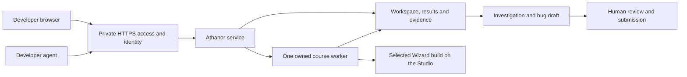

# Athanor on a shared Mac runner

Design proposal, October 2, 2026. The local dashboard changes are implemented; shared hosting and remote execution are not deployed. This plan uses the inspected Athanor source. Studio availability, desktop session and capacity still need a bounded host inspection.

## The first pilot

A developer opens a private HTTPS URL, selects a build and course, prepares the build, and runs it on the Studio. They can close the browser or use their own Mac for other work. Results, captures, investigations and bug drafts remain available at the same URL.

One developer controls one run at a time. Other authorized people can read results. Start with the existing service, SQLite workspace, detached course worker and desktop lease. A distributed scheduler is unnecessary for this pilot.

The browser is a remote controller. Build discovery, download, instrumentation, fixtures and test execution happen on the runner. A browser ZIP upload transfers a package to that runner; a path field refers to the runner's disk. Every run and agent prompt should name the execution machine so users do not mistake a Studio path for a path on their laptop.

The run flow should be:

1. Show the runner name, availability and current operator. Choose a build from the catalog or upload a ZIP.
2. Choose a course and prepare. Show real download/setup steps and a repair prompt on failure.
3. Review the selected package identity, effective checks and desktop requirements. Start the run under the signed-in user's identity.
4. Keep progress and elapsed time available after browser reconnection. A busy runner offers a link to its current run. It does not start another course or take over the desktop.
5. Open results and evidence. Investigations returns to the same first run and its linked repro attempts.
6. Export an agent package for classification and deduplication. An agent proposes focused repro work; the operator approves execution on the shared machine.
7. Prepare the focused diagnostic course, retain its failed state and evidence, then review the Bug Reporter draft. Submission remains a human action.

## Hosting and access

Tailscale Serve can publish a loopback service over private HTTPS to permitted tailnet members. Access rules apply to Serve. It is a suitable candidate if the developers have access to the team's tailnet. [Tailscale Serve documentation](https://tailscale.com/docs/features/tailscale-serve)

Keep Athanor bound to loopback behind the access layer. The existing `server.mjs` accepts only loopback Host values, checks HTTP origins on writes, and has no authenticated users or roles. A reverse proxy alone does not make this a hosted app: the external HTTPS origin would fail the present guard, and rewriting away that guard would weaken the intended boundary.

Before exposure, implement an explicit hosted profile with:

- An exact configured public origin, preserving the default local profile and rejecting other Hosts/origins. No wildcard CORS.
- Verified identity from a trusted proxy or app session, with a clear viewer/operator boundary. A typed operator name or arbitrary client header is not authentication. Protect write requests and authenticate agent requests too.
- One admission guard across preparation, full courses, diagnostic repros and desktop exploration. Only the controlling operator can stop a run. A second browser must receive Busy with the active run link.
- Build imports and evidence downloads restricted to the approved workspace. Retain the existing archive validation, file inventories and checksums.
- UI copy and handoff prompts that distinguish local browser files, runner files and server-side execution. Hosted agents use the authenticated API; they should not receive instructions to execute Studio-local shell paths on their own Mac.

Use external persistent storage for the SQLite workspace, installed builds, fixture/model caches and evidence. Retain source/definition/build identities with each run, back up the workspace consistently with SQLite, and define retention before captures fill the disk. Evidence already has immutable export packages; keep those URLs stable through upgrades.

## Desktop execution is the constraint

Wizard desktop checks need a logged-in, unlocked GUI session with the required screen/input permissions. A browser session does not create that desktop. Apple distinguishes user-session agents from system daemons; daemons cannot use the WindowServer to display or launch GUI work. [Apple service design guidance](https://developer.apple.com/library/archive/documentation/MacOSX/Conceptual/BPSystemStartup/Chapters/DesigningDaemons.html)

Run the desktop worker as an agent in the intended runner user's session. Show its readiness separately from web-service health. If the desktop locks or a foreground overlay blocks input, stop the affected interaction with retained Blocked/Unknown evidence. Never bypass the lock screen. Headless checks can remain independent of GUI readiness when the selected course permits it.

The Studio also hosts other work. Its existing workload and resource policies must be checked before choosing a runtime account or starting courses. Begin with serialized testing and an agreed execution window. CPU, GPU, memory, IO and foreground input can all contend; a user account alone does not isolate those resources.

## How it scales

| Stage | Change | Trigger |
| --- | --- | --- |
| One operator | Private URL, persistent workspace, one admitted job and visible owner | First shared pilot |
| Several requesters | Durable FIFO queue, authenticated ownership, queued cancel, viewer/operator roles | People need to submit while the runner is busy |
| More throughput | Add Mac workers with declared capabilities and one desktop lease per machine | Queue time becomes a problem |
| Larger evidence history | Separate retained evidence storage from worker disks, with authenticated artifact access | Disk use or transfer time warrants it |

Keep course definitions and assertions common to UI and agents at every stage. Freeze the build, course, fixtures and instrumentation identity at admission. Later, add `runnerId`, requester identity, lease/heartbeat and execution attempt identity to that same job contract. Workers report progress and immutable artifacts back to the service. A lost worker produces an interrupted or Unknown attempt; it does not replay an uncertain app action.

Multiple browser viewers do not require multiple Wizard instances. For physical computer use, scale by adding independent desktop machines. Add headless concurrency only after resource measurements justify it; avoid concurrent perf checks on a busy host.

## Next implementation slice

1. Inspect the Studio's current workloads and desktop readiness without starting work.
2. Implement and locally verify the hosted access/origin profile and requester/operator controls.
3. Prove single admission across all execution entry points, browser reconnect, Busy behavior and retained reports.
4. Prepare the concrete install/service/access configuration for review. Deploy only with specific Studio authorization.
5. Run one small headless pilot, then one desktop course in an authorized GUI window. Confirm reconnect and investigation/report access from a second developer's browser.

The local UI pass adds a permanent Investigations view, search and saved next-step filters, links from first runs and focused repros, and clearer stage navigation. Those changes use the same investigation records that a hosted service would serve.
